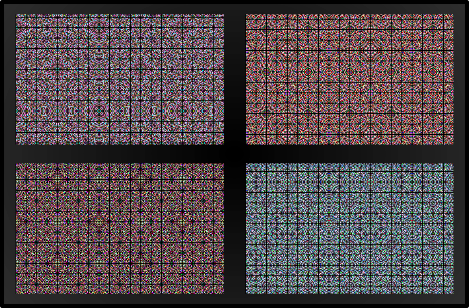
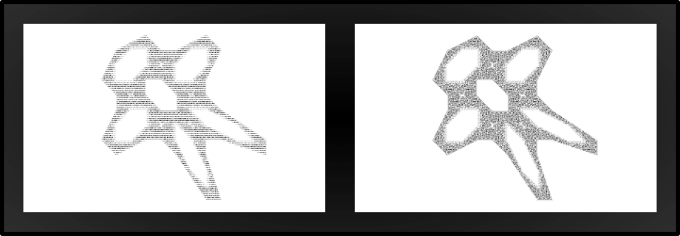
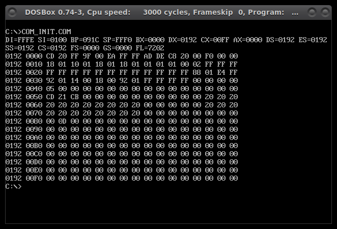

# Small DOS intros 

## tappeto (32b)
pix(x,y) = $x^2y^2$

Bonus: two extra variations! Wooooo

(ESC support, 256-colors VGA standard palette)

## manly (64b)
An IFS that I found in an old Byte magazine issue (not sure though!) with its lovely BASIC source code. i386+

(ESC support, VGA greyscale)

## com_init (128b)
Displays the values of all x86 registers and dumps the PSP segment in less than 128 bytes. Useful for size coding small intros. i386+

